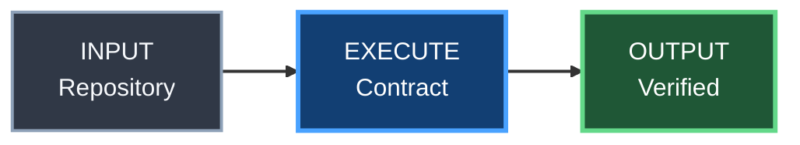
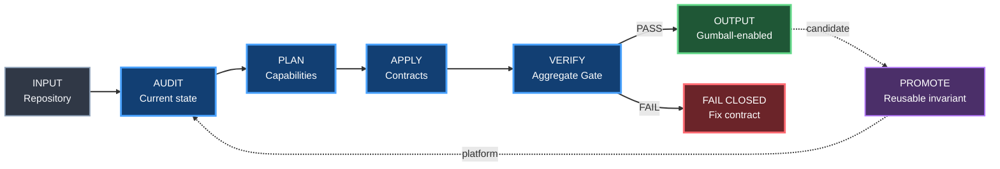

# Gumball Blueprint diagram style

Status: **ACTIVE / AUTHORITATIVE**

## Purpose

Gumball uses a shared Mermaid visual language inspired by Unreal Engine Blueprint graphs.

The goal is not to reproduce the Unreal Editor pixel-for-pixel. The goal is to make architecture, CI, agent, tooling and data-flow diagrams immediately recognizable across Gumball-enabled repositories while keeping them text-based, diffable and maintainable.

## Adoption rule

New or substantially revised diagrams for architecture, CI/CD, agents, tooling, data flow, runtime proof and platform adoption should use this style.

Do **not** rewrite a correct existing diagram only for cosmetics. Migrate it when the owning SSOT is already being materially changed.

`gumball apply` creates this style contract when it is missing. Existing project-owned diagram rules are preserved and must be reconciled rather than overwritten.

## Blueprint node classes

| Class | Meaning | Visual role |
|---|---|---|
| `input` | external input / source | slate |
| `exec` | action / workflow / runtime step | Blueprint blue |
| `tool` | tool / MCP / agent / adapter | violet |
| `decision` | classifier / policy decision | amber |
| `success` | accepted / verified output | green |
| `danger` | blocker / fail-closed state | red |
| `owned` | consumer-owned implementation | graphite |
| `evidence` | artifact / proof / provenance | cyan |

## Canonical class definitions



## Edge semantics

- solid edge — execution or required dependency;
- dashed edge — feedback, provenance, optional relationship or promotion loop;
- labelled edge — meaningful transition such as `PASS`, `FAIL`, `adopt`, `promote`;
- thicker edge — primary execution spine when it materially improves readability.

Avoid decorative crossings. Prefer a subgraph or a different layout when ownership becomes unclear.

## Node wording

Prefer Blueprint-like compact labels:

```text
AUDIT
Repository

PLAN
Capabilities

VERIFY
Aggregate Gate
```

Use a short operation/state on the first line and one concise qualifier below it.

Do not put paragraphs inside nodes.

## Project extensions

Consumers may add project-specific classes, for example:

- Unreal runtime/editor;
- Android/native;
- Home Lab;
- Kubernetes;
- database/data-plane.

Extensions must preserve the shared semantic meaning of the base classes. A reusable extension should be evaluated for promotion back into Gumball rather than drifting independently across repositories.

## Example: adoption and feedback loop



## Propagation

The style is part of the Gumball baseline, not a Gumball-only decoration.

When a consumer adopts or upgrades Gumball:

1. add `docs/DIAGRAM_STYLE.md` if no project-owned equivalent exists;
2. preserve existing diagrams;
3. use the Blueprint style for new or substantially revised architecture/workflow diagrams;
4. evaluate reusable visual conventions for upstream promotion.

This keeps YACS, 4VELO, ONICS, Karoo and future projects visually related without forcing product-specific diagrams into one rigid template.

