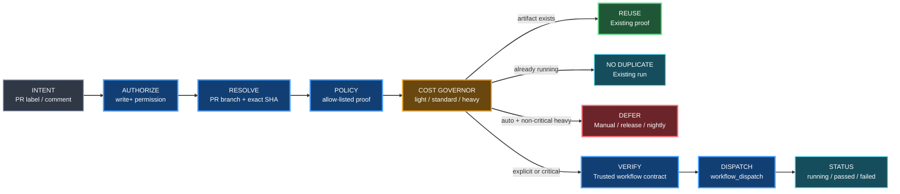

# Gumball Proof Broker

Status: **ACTIVE / AUTHORITATIVE**

## Goal

Heavy proof workflows should not require routine clicking through GitHub Actions.

A trusted user should be able to request a configured proof directly from a pull request:

```text
/gumball proof <proof-id>
```

or by applying the configured `proof:<proof-id>` label.

The broker validates the request, exact PR revision, proof allow-list, workflow contract, duplicate state and CI-cost policy before dispatching anything.

## Control flow



## Trusted execution boundary

The broker workflow itself runs trusted default-branch code.

It never checks out the pull-request head while holding `actions: write`.

The default contract is:

1. broker definition/script comes from the repository default branch;
2. target proof workflow definition also comes from the default branch;
3. the PR head branch and exact 40-character SHA are passed as explicit workflow inputs;
4. the proof workflow checks out the requested source SHA using read-only repository access;
5. the proof workflow's `run-name` includes the deterministic Gumball request id.

This separates **trusted orchestration** from **untrusted/changing source under test**.

Branch-local workflow definitions are disabled by default.

## Deterministic request id

A request is keyed by:

```text
proof-id + PR number + exact PR head SHA
```

For example:

```text
gb-r4-1b3-geometry-pr239-b72f8927c4ad
```

The target workflow must accept the configured request-id input and include it in `run-name`.

That gives the broker a stable way to find queued/running/completed proof runs and prevents duplicate heavyweight work for the same revision.

## Proof policy

Consumers configure proofs in `.gumball/proof-broker.json`.

Example:

```json
{
  "schema_version": 1,
  "proofs": {
    "r4-1b3-geometry": {
      "enabled": true,
      "workflow": "passo-giau-r4-1b3-geometry.yml",
      "label": "proof:r4-1b3-geometry",
      "cost_class": "heavy",
      "merge_critical": false,
      "dispatch_ref": "default",
      "request_id_input": "gumball_request_id",
      "inputs": {
        "source_ref": "$branch",
        "exact_sha": "$sha",
        "pull_request": "$pr_number",
        "gumball_request_id": "$request_id"
      },
      "artifact_name": "proof-$proof-$sha",
      "allowed_write_permissions": [],
      "automatic": {
        "enabled": false,
        "require_ci_class": "heavy"
      }
    }
  }
}
```

Supported input tokens:

- `$branch` — PR head branch;
- `$sha` — exact PR head SHA;
- `$pr_number` — pull request number;
- `$request_id` — deterministic broker request id;
- `$proof` — proof id.

Other values are passed literally.

## Trigger modes

### Comment

```text
/gumball proof r4-1b3-geometry
```

Explicit retry after a failed run:

```text
/gumball proof r4-1b3-geometry retry
```

Status-only query:

```text
/gumball proof r4-1b3-geometry status
```

### Label

Applying the configured proof label is an explicit request.

The broker verifies that the actor has one of the configured repository permissions before dispatching.

Automation/apps can be trusted explicitly through `defaults.trusted_actor_logins`. The default list is empty: Gumball never treats every bot as trusted. A consumer may add the exact login of its approved ChatGPT/Codex/GitHub App actor so an agent can request a proof without the human opening the Actions UI.

### Automatic

A proof may opt into automatic dispatch, but the broker does **not** wake up on every PR synchronize event.

A cheap trusted classifier emits a `repository_dispatch` event only when it believes a configured proof may be required:

```json
{
  "event_type": "gumball-proof-request",
  "client_payload": {
    "proof": "r4-1b3-geometry",
    "pr_number": 239
  }
}
```

The broker then independently re-evaluates the proof policy and current PR paths.

Automatic heavy proof is allowed only when:

- the proof policy marks it `merge_critical=true`;
- the change classification matches the configured CI class;
- no reusable artifact/successful run exists;
- no identical proof is queued/running.

Non-merge-critical heavy proof is **DEFERRED** rather than burned automatically.

This design avoids spending a runner merely to discover on every commit that no heavy proof is needed.

### Manual fallback

The target workflow keeps ordinary `workflow_dispatch` support as an emergency fallback.

The broker reduces routine clicking; it does not remove GitHub's manual recovery path.

## Artifact reuse

If `artifact_name` is configured, the broker looks for a non-expired exact artifact before dispatch.

A matching artifact produces `REUSE` rather than a new heavy run.

Artifact identity should include the exact proof id and source SHA or a stronger build/proof fingerprint.

## Existing runs

For the deterministic request id:

- queued/in-progress -> `ALREADY_RUNNING`;
- completed success -> `REUSE_RUN`;
- completed failure -> `FAILED_EXISTING` until explicit `retry`;
- explicit retry reruns the existing failed workflow rather than creating uncontrolled duplicate history.

## Status labels

The broker maintains status labels **per proof**, so multiple independent proofs can coexist on one PR:

- `proof-status:<proof-id>:requested`;
- `proof-status:<proof-id>:running`;
- `proof-status:<proof-id>:passed`;
- `proof-status:<proof-id>:failed`;
- `proof-status:<proof-id>:deferred`;
- `proof-status:<proof-id>:reused`.

For example, `proof-status:r4-1b3-geometry:passed` can coexist with `proof-status:visual:running`.

The proof request label remains separate, for example `proof:r4-1b3-geometry`. A comment-triggered request adds that request label automatically so the hourly reconciler can continue tracking the proof after dispatch.

## Consumer workflow contract

A broker-managed proof workflow must:

- exist on the default branch;
- support `workflow_dispatch`;
- accept the configured exact-SHA input;
- accept the configured request-id input;
- include that request id in `run-name`;
- use and reference the exact requested source-SHA input for the proof;
- run read-only by default; any `*: write` workflow permission must be explicitly allow-listed in the proof policy;
- never use `permissions: write-all`;
- produce the configured artifact name when artifact reuse is enabled.

Example shape:

```yaml
name: Heavy geometry proof
run-name: proof ${{ inputs.gumball_request_id }}

on:
  workflow_dispatch:
    inputs:
      source_ref:
        required: true
        type: string
      exact_sha:
        required: true
        type: string
      pull_request:
        required: true
        type: string
      gumball_request_id:
        required: true
        type: string

permissions:
  contents: read

jobs:
  proof:
    runs-on: ubuntu-latest
    steps:
      - name: Checkout exact requested revision
        uses: actions/checkout@3d3c42e5aac5ba805825da76410c181273ba90b1
        with:
          ref: ${{ inputs.exact_sha }}
          persist-credentials: false

      - name: Verify exact SHA before expensive work
        shell: bash
        env:
          EXPECTED_SHA: ${{ inputs.exact_sha }}
        run: |
          set -euo pipefail
          test "$(git rev-parse HEAD)" = "${EXPECTED_SHA}"
```

The expensive proof starts only after the exact-revision assertion succeeds.

## Recovery

If broker configuration, workflow contract, requester permission or Projects/API access is ambiguous, the broker returns **BLOCKED** and does not dispatch.

No proof should be started merely because Gumball could not determine whether it was safe.

